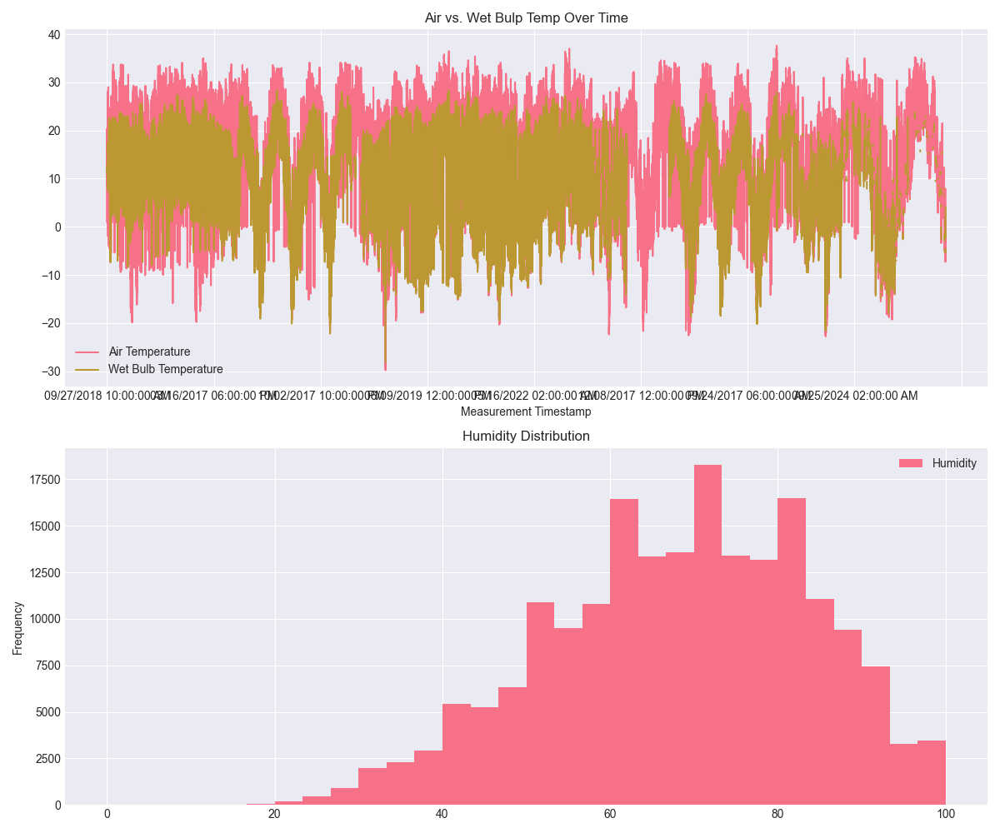
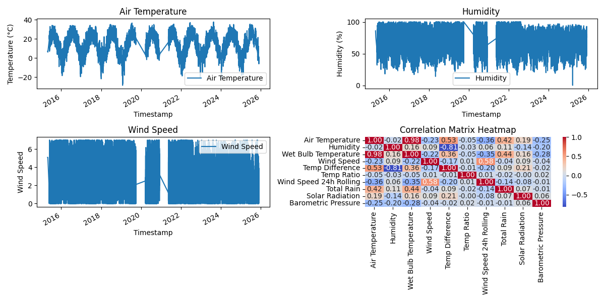

# Chicago Weather Analysis

## Executive Summary
This weather report analyzes data from Chicago Beaches along Lake Michigan. The dataset contained 196315 measurements from April 25, 2015 to December 3, 2025 across three different weather stations there. This project is a 9 section report that attempts to build a predictive model for humidity based off the data. We were able to create a Random Forest model with an R^2 of 0.757 and an RSME of 7.417%, demonstrating that with feature engineering, we are able to create an accurate predictive model. 

## Phase 1-2: Exploration

196315 Rows and 14 columns of data were initially loaded from a csv. The columns were Air Temperature, Wet Bulb Temperature, Humidity,  Rain Intensity, Interval Rain, Total Rain, Precipitation Type, Wind Direction,  Wind Speed, Maximum Wind Speed, Barometric Pressure, Solar Radiation,  Heading, and Battery Life. The Data was from April 25, 2015 to December 3, 2025.

**Key Data Quality Issues Identified:**
- 75 missing values in Air Temperature (0.04%)
- 75948 missing values in Wet Bulb Temperature (38.7%)
- The Missing values in Rain Intensity, Total Rain, Precipitation Type, and Heading (same 75948 records)
- All of these missing values were from the same weather station, indicating a pattern in the missing values
- 146 missing values in Barometric Pressure

*Figure 1: Mapping Air and Wet Bulb temperatures to each other, and showing the distribution of Humidity*

## Phase 3: Data Cleaning

Data cleaning was handled through both imputation and removal of values. For random missing values and outliers, imputation was utilized due to the temporality of the data. For patterns in missing values, removal was used.

**Cleaning Results:**
- Rows before cleaning: 196315
- Missing values: Forward-filled
  - Air Temperature: 75 missing → 0 missing
  - Barometric Pressure: 146 missing → 0 missing
- Missing values: Removed
  - Wet Bulb Temperature, Rain Intensity, Total Rain, Precipitation Type, and Heading: 75948 missing → 0 missing
- Outliers: Capped using IQR method (3×IQR bounds)
 - Filled using both ffill() and bfill()
- Duplicates: Removed (0 duplicates found)
- Data types: Measurement Timestamp and Measurement Timestamp Label converted to datetime.
- Rows after cleaning:  (120367 rows remaining)

Due to missing all of the data from Foster station, the decision was made to remove all data regarding that station, as using the information from other stations to fill that data may be inaccurate. For outliers, the expertise needed to specify bounds was not had, so IQR ranges were used to set limits instead. 

## Phase 4: Data Wrangling

As mentioned before, Measurement Timestamp was convered to the datetime datatype in order to utilize temporal analysis on the dataset. Measurement Timestamp was also set as the index for the dataframe. The format used was YYYY-MM-DD HH:MM:SS.

**Temporal Features Extracted:**
- `hour`: Hour of day (0-23)
- `day_of_week`: Day of week (0=Monday, 6=Sunday)
- `month`: Month of year (1-12)

## Phase 4: Feature Engineering

We created three derived variables and one rolling variable.

**Derived Features:**
- Temp Difference was the difference between Air Temperature and Wet Bulb Temperature
- Temp Ratio was the ratio between Air Temperature and Wet Bulb Temperature

**Rolling Window Features:**
- Wind Speed Rolling 24h: 24-hour rolling mean of wind speed
- Total Rain 6h Rolling: 6-hour rolling mean of Total Rain

**Categorical Features:**
- Humidity Level was a categorical feature for humidity, with <50 representing a low value, 50 >= & <=80 representing a middling value, and <80 representing a high value.

## Phase 5: Pattern Analysis

**Temporal Trends:**
- Air Temperature: Clear seasonal trends, with it being higher during the summer and lower during the winter.
- Humidity: Some seasonal trend, not quite as strong as temperature trends.
- 
**Correlations:**
- Air Temperature shows a mild positive correlation with Total Rain, indicating that higher temperatures may be associated with increased rainfall in this dataset.
- Humidity has a moderate negative correlation with Temp Ratio, suggesting that as humidity increases, the difference of Wet Bulb to Air Temperature decreases.

*Figure 2: Advanced pattern analysis showing monthly temperature trends, how those match up with humidity and wind speeds, and a correlation heatma with extended variable inclusion*

## Phase 6: Modeling Preperation

Humidity was chosen as the target variable. Predictor variables chosen were Wet Bulb Temperature, Wind Speed 24h Rolling, and Total Rain.

**Temporal Train/Test Split:**
- We used an 80/20 Split based on temporality
- Training: 96,293 rows
- Testing: 24,074 rows
  

## Phase 7: Modeling

Linear Regression and Random Forest were the two models chosen.

**Model Performance:**

| Model | R² Score | RMSE | MAE |
|-------|----------|------|-----|
| Linear Regression | 0.639 | 9.032% | 6.994% |
| Random Forest | 0.757 | 7.417% | 5.046% |

**Key Findings**
- Linear Regression performed well, achieving an R^2 of 0.639. However, this is still below the desired R^2 of 0.7.
- Random Forest finished with an R^2 of 0.757, outperforming Linear Regression. 
- The RMSE difference between Linear Regression and Random Forest is only around ~1.5%

**Feature Importance**
- Random Forest
- Temperature Difference: 76.7% Importance
- Total Rain: 9.9% Importance
- Month: 13.4% Importance.

Temperature Difference being an important indicator to humidity lines up, as Wet Bulb Temperatures rely upon water evaporation. The Month was a more important predictor than Total Rain, indicating that there are potentially other weather features with seasonal cycles that have a higher impact than the rain on humidity.

*Figure 3: Visualisations of actual versus predictors for linear regression, and feature importance for random forest.*

## Phase 8: Results

Our best performing model, Random Forest, predicts humidity within 7.417% which is relatively accurate.

**Summary of Key Findings:**
1. **Model Performance:** Our Random Forest model has an R^2 of 0.757, meaning that it is able to explain 75.5% of variance in humidity with these three features.
2. **Feature Importance:** Temperature Difference is the biggest predictor, indicating that the difference between air temperature and the wet bulb temperature which is primarily due to evaporation, is a strong predictor of humidity.
3. **Data Quality:** Our data cleaning process did not try to infer data points from which we had no reference, and only tried to fill points that we were sure would be reliable due to patterns and temporality.
4. **Data Leakage Avoidance:** We made sure to avoid any features that were created from the target variable in order to keep the model generalizable. 

## Visualizations

*Figure 1: Mapping Air and Wet Bulb temperatures to each other, and showing the distribution of Humidity*

*Figure 2: Advanced pattern analysis showing monthly temperature trends, how those match up with humidity and wind speeds, and a correlation heatma with extended variable inclusion*

*Figure 3: Visualisations of actual versus predictors for linear regression, and feature importance for random forest.*

## Model Results

Both of our models, Linear Regression and Random Forest, performed relatively well. Random Forest outperformed Linear Regression in all three metrics of R^2, RMSE, and MAE.

**Performance Interpretation:**
- **R² Score:** Random Forest explains 75.7% of variation in humidity.
- **RMSE (Root Mean Squared Error):** Average prediction error in original units. The RMSE for our Random Forest model was 7.417%, meaning that the humidity % was usually within 7.417% prediction.
- **MAE (Mean Absolute Error):** Average absolute prediction error. The MAE for our Random Forest model was 5.046%, which is decent accuracy.

**Model Selection**
- Random FOrest is chosen as our superior model in this case.
- It had a higher R^2 than Linear Regression (0.757 > 0.639)
- The RMSE and MAE were both lower than that of Linear Regression (7.417 < 9.032), (5.046 < 6.994)

**Feature Importance Insights:**
The feature importance analysis reveals that:
- Temperature Difference between the air and wet bulb temperatures is the strongest predictor of  humidity
- The temperature difference is primarily caused by evaporation, suggesting that humidity is strongly related to water evaporation.
- The Month was a stronger predictor than Total Rain, indicating that there are other seasonal weather features more important than the rainfall.
  
## Time Series Patterns
**Long-term Trends:**
- Yearly patterns seem consistent over long periods of time
- Indicates stable yearly trends
- Specifically for the temperatures (Air Temperature and Wet Bulb Temperature) and Humidity

## Limitations & Next Steps
**Data Quality**
- Missing an entire stations worth of data may have weakened our predictive capabilities
- Whether this is more damaging than improperly filling missing data is unknown
- A lack of topic knowledge may have limited the effectiveness of our outlier removal.
- Only 3 weather stations data gathered - Which was dropped down to 2 during our cleaning process

**Model Weakness**
- Linear Regression did not quite reach the 0.7 R^2 threshold.
- Only 3 features were used in our Random Forest Model, which may have limited our predictive power.
- A variablility in prediction of 7.417% RMSE may not be high enough in all scenarios. 

**Feature Engineering**
- Higher utilization of temporal features could be implemented
- Using hour windows with higher versus lower water evaporation (eg. noon versus dawn) could be implemented.
- Features involving both rainfall and temperature (test water evaporation)

**Next Steps:**

**Model Improvement**
- Experimenting with further feature engineering on temporality may allow for rapid improvement of dataset.
- External data sources with more related information may improve predictability

**Feature Engineering**
- Look more closely at previous features we have discovered affect humidity, and attempt to build off that
- Utilize daily cycles of water evaporation

**Analysis Extension:**
- Extend analysis beyond single target variables
- Further implement temporal features in models

**Validation**
- Validate upon other time period datasets
- Further review features in feature importance

## Conclusion
The analysis from this project sucessfully created two models for humidity prediction. Of the two models, our Random Forest model achieved more predictive results with an R^2 of 0.757 and and RSME of 7.417%. In this project, we proved the importance of feature engineering in our temperature difference variable, created from the difference between air and wet bulb temperatures. Through pattern analysis, we disovered a seasonal trend of humidity, and this proved to be somewhat important, with month as the second most important feature in our Random Forest model. We discovered that Random Forest outperformed Linear Regression as a predictor for humidity in this model. We made sure to avoid any data leakage by avoiding using any features created from the outcome target, and created a generalizable model.